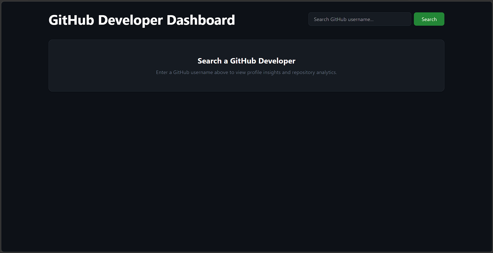
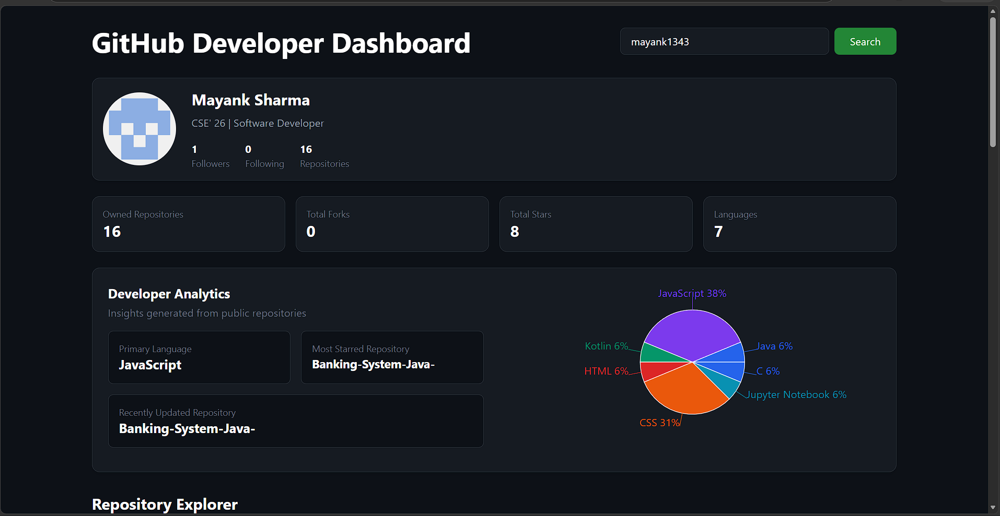
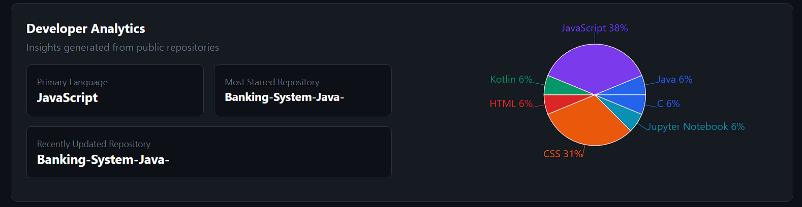
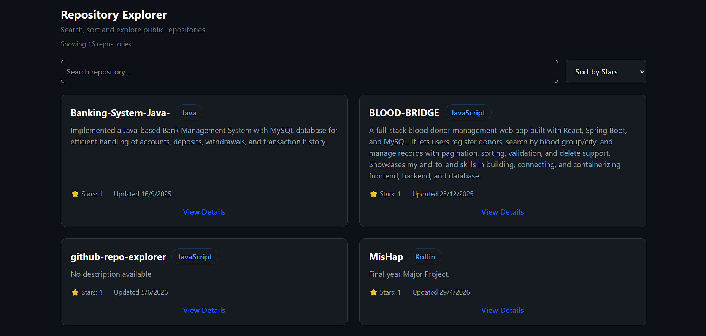

# GitHub Developer Dashboard

> A full-stack analytics dashboard that transforms raw GitHub profile data into meaningful developer insights.


---

## Live Demo

🌐 Frontend: https://github-dev-dashboard.vercel.app

⚙️ Backend API: https://github-dashboard-api-zz83.onrender.com

---

## Overview

GitHub Developer Dashboard is a full-stack web application that allows users to search any public GitHub profile and instantly explore developer statistics, repository insights, language distribution, and repository analytics.

The project was built to demonstrate practical full-stack engineering concepts including API integration, caching, state management, data visualization, responsive UI design, deployment, and production-ready architecture.

---

## Features

### Developer Profile Dashboard

* Developer avatar and profile information
* Bio, followers, following, and repository statistics
* Clean and responsive profile layout

### Repository Explorer

* Search repositories by name
* Sort repositories dynamically
* Expand repository details
* View repository metadata including:

  * Stars
  * Forks
  * Open Issues
  * Default Branch
  * Last Updated Date

### Developer Analytics

* Primary language detection
* Most starred repository
* Recently updated repository
* Total stars and forks
* Repository language distribution

### Data Visualization

* Interactive language distribution pie chart
* Repository analytics overview
* Dynamic metric generation from GitHub data

### User Experience

* Dark theme interface
* Recent search history using Local Storage
* Full-screen loading spinner
* Render server wake-up notification
* Error handling and validation
* Responsive design across devices

### Performance Optimization

* Server-side caching layer
* Reduced GitHub API requests
* Faster repeated searches
* GitHub Personal Access Token integration to avoid rate limiting

---

## System Architecture

| Layer | Responsibility |
|---------|---------------|
| React Frontend | User interface, state management, data visualization |
| Express Backend | API orchestration and data transformation |
| Cache Service | Reduces redundant GitHub API requests |
| GitHub REST API | Source of developer and repository data |

### Data Flow

User Search
↓
React Frontend
↓
Express Backend
↓
Cache Check
↓
GitHub API (if cache miss)
↓
Processed Response
↓
Analytics Dashboard

---

## Tech Stack

### Frontend

* React
* Tailwind CSS
* Recharts
* Axios
* React Icons

### Backend

* Node.js
* Express.js
* Axios

### APIs

* GitHub REST API

### Deployment

* Vercel (Frontend)
* Render (Backend)

---

## Project Structure

```text
github-repo-explorer/
│
├── client/
│   ├── src/
│   │   ├── components/
│   │   ├── pages/
│   │   ├── services/
│   │   ├── App.jsx
│   │   └── main.jsx
│   │
│   └── package.json
│
├── server/
│   ├── controllers/
│   ├── routes/
│   ├── services/
│   ├── app.js
│   └── package.json
│
└── README.md

---

## Analytics Implemented

The dashboard derives several metrics directly from GitHub repository data:

| Metric                      | Description                        |
| --------------------------- | ---------------------------------- |
| Total Stars                 | Combined stars across repositories |
| Total Forks                 | Combined forks across repositories |
| Primary Language            | Most frequently used language      |
| Most Starred Repository     | Repository with highest stars      |
| Recently Updated Repository | Most active repository             |
| Language Distribution       | Repository breakdown by language   |

---

## Screenshots

### Dashboard Overview



### Profile & Analytics



### Language Distribution



### Repository Explorer



---

## Installation

### Clone Repository

```bash
git clone https://github.com/Mayank1343/github-repo-explorer.git
cd github-repo-explorer
```

### Backend Setup

```bash
cd server
npm install
npm run dev
```

### Frontend Setup

```bash
cd client
npm install
npm run dev
```

---

## Environment Variables

### Backend

Create:

```text
server/.env
```

```env
PORT=5000
GITHUB_TOKEN=your_github_personal_access_token
```

### Frontend

Create:

```text
client/.env
```

```env
VITE_API_URL=http://localhost:5000/api/github
```

---

## Production Deployment

### Frontend

Hosted on Vercel

### Backend

Hosted on Render

### Note

The backend runs on Render's free tier. The first request after inactivity may take a few seconds while the server wakes up.

---

## Challenges Solved

### GitHub API Rate Limiting

Implemented GitHub Personal Access Token authentication to increase API request limits from:

```text
60 requests/hour
```

to

```text
5000 requests/hour
```

### Faster Response Times

Implemented server-side caching to reduce redundant GitHub API requests and improve response times.

### Production Deployment

Configured environment-based API endpoints and deployed the application using Vercel and Render.

---

## Learning Outcomes

This project strengthened practical understanding of:

* Full-Stack Application Development
* REST API Integration
* Backend Service Architecture
* Caching Strategies
* Environment Configuration
* Data Transformation
* State Management
* Data Visualization
* Deployment Workflows
* Production Debugging

---

## Future Enhancements

* GitHub OAuth Authentication
* Repository Comparison Tool
* Contribution Activity Tracking
* Advanced Developer Insights
* Repository Trend Analysis

---

## Author

**Mayank Sharma**

B.Tech Computer Science Engineering
Graphic Era Hill University

GitHub: https://github.com/Mayank1343

LinkedIn: https://www.linkedin.com/in/mayanksharmaa13/

---

⭐ If you found this project interesting, consider giving it a star.
